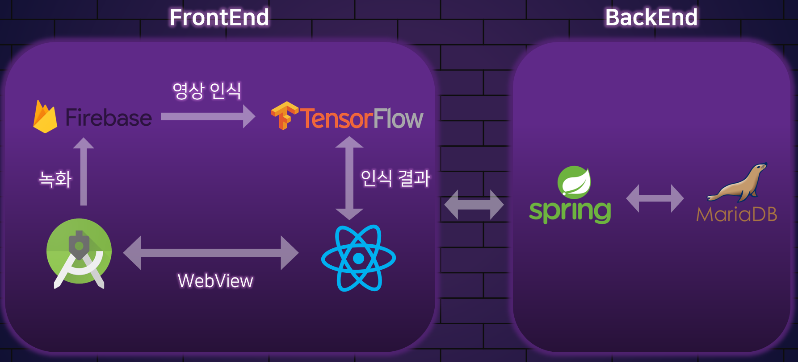

# 💃Shake Up

`온라인 댄스 학습 플랫폼`

__Shake up 이란?__

1. 몸을 흔들다

2. 큰 변화를 일으키다  

#### 👆클릭 시 UCC 영상으로 이동!
[](https://www.youtube.com/watch?v=PecaFVn66D8)


## 🌈프로젝트 개요

춤을 잘 추고 싶으신가요?

자신이 춘 영상을 공유하고 싶으신가요?

춤을 사랑하는 사람들을 위해 **Shake Up** 을 준비했습니다!

__Shake Up__ 에서 함께 춤을 즐겨보세요!  


#### 💫Tech Stacks & IDE ####

- 

-   


#### 📅프로젝트 기간 ####

- 2022.01.10 ~ 2022.02.18  


#### 🌟기획 의도 ####

- 코로나 19로 인해 오프라인 위주의 댄스 교육에 참여하기 어려운 아마추어 댄서들이 온라인 상에서 댄스를 배울 수 있다!

- 춤을 추면서 다이어트도 하고 건강해지자!
- 개발자도, 사용자도 모두 즐거워하는 서비스를 개발하자!  


#### 🌟기획 배경 ####

- '스트릿 우먼 파이터' 등 댄스 방송을 통해 사회 전체적으로 국내 댄서에 대한 인식이 높아졌다.

- 일반인들도 유튜브, 틱톡 등 비디오 플랫폼을 보며 댄스에 관심을 갖고, 배우고 싶은 의욕이 높아졌다.
- __설문조사 실시 결과(2022.01.12 ~ 2022.01.14, 20대 18명 대상)__ : 먼 거리에서 오프라인으로만 이뤄지는 댄스 교육을 받기 어렵고, 올바르게 춤을 추고 있는지 알기 어렵다는 의견이 있었다.  


#### 📄기획서

- [Shake Up 기획서](https://www.notion.so/D103-PJT-c78a7f3e6bcd47da97c96dcc1298bc27)  


#### 🖼와이어프레임

  

   

   


#### 📋기능 명세서 & 테스트 케이스

- [기능 명세서 & 테스트 케이스](https://docs.google.com/spreadsheets/d/1aXiM5Yno-RHuojN0EQbiN67ZDSFzH-xj7Qvfr8-OG5Y/edit#gid=0)


## 💡주요 기능


### 🤸‍♀️댄스 따라하기

- 춤을 추거나 춤 동작을 배우고 싶은 사람들을 위한 기능 제공

- 스마트폰 카메라에 나타난 춤을 따라 추고 나면, 인공지능이 동작의 정확도를 파악해 맞춘 동작 개수를 알려줍니다.

- 댄스를 따라 추고, 맞춘 동작을 확인 한 후, 결과를 볼 수 있습니다!

       


- 자신의 채널에 영상을 업로드할 수 있습니다!

     


### 🏆댄스 월드컵

- 누구나 자유롭게 영상을 올려서 참가하는 온라인 댄스 배틀!
- 두 개의 영상 중 원하는 영상을 선택해서 더 많은 선택을 받은 댄서가 승리!

- 현재 기간동안 열리는 댄스 월드컵에 참여 및 투표하기
- 그 기간 동안 진행되는 댄스들에 대한 랭킹 보기

- 월드컵에 참여하고, 랭킹을 볼 수 있어요!

    

- 월드컵에 투표하고 결과를 볼 수 있어요!

    


### ▶️채널 시스템

- 내가 올린 영상과 댄스 따라하기, 댄스 월드컵의 점수를 볼 수 있습니다.
- 관심 있는 댄서들의 채널을 팔로우해서 볼 수 있습니다.

- 댄따 참여 영상 목록, 댄스 월드컵에 참여한 자신의 영상 목록을 볼 수 있어요!

   

- 업로드한 영상 목록, 구독한 사람의 영상 목록을 볼 수 있어요!

   


#### 👀시연 시나리오

- [시연 시나리오](https://github.com/apdltpdl22/Shake-Up/blob/master/exec/%EC%8B%9C%EC%97%B0%EC%8B%9C%EB%82%98%EB%A6%AC%EC%98%A4.md)


## 🌈개발 환경

|                           Backend                            | Version |
| :----------------------------------------------------------: | :-----: |
|  |         |
|  | 11.0.12 |
|  |   8.0   |
| </img> |  2.4.0  |
| </img> |  2.5.4  |
| </img> |         |
|          |         |
|  |  2.9.2  |
|  |  0.9.1  |


|                           Frontend                           | Version |
| :----------------------------------------------------------: | :-----: |
|  |         |
|  | 17.0.2  |
|  |         |
|  |  4.1.2  |
|  |         |


|                            CI/CD                             |
| :----------------------------------------------------------: |
|  |
|  |
|  |


## 🌈서비스 아키텍처




## 🌈CI/CD

**Shake Up**은 **Jenkins**를 사용하여 자동 배포를 구축하였습니다.

Gitlab Webhook을 설정하여 Jenkins의 **Gitlab trigger를 설정하였고,** Gitlab의 **Master branch**에 Push가 되면 Frontend, Backend가 자동으로 Build가 되고 실행이 되어 배포가 가능하도록 구축하였습니다.

또한, Frontend에서 사용한 React.js는 Nginx를 사용하여 배포하고, Backend는 Build하여 나온 jar 파일을 nohup 명령어를 사용하여 백그라운드에서 실행하고 배포되도록 하였습니다.

- [배포 방법 보기](https://lab.ssafy.com/s06-webmobile2-sub2/S06P12D103/-/blob/develop/exec/AWS%EB%B0%B0%ED%8F%AC%EB%B0%A9%EB%B2%95.md)


## 🌈기술 특이점

#### Tensorflow.js

- Pose Detection을 통한 춤 동작 인식

  - [PoseNet 이란?](https://www.notion.so/PoseNet-c87bc00c193e4d31adff76945af9a36f)

- Teachable Machine

  - 노래의 춤 동작 중 큰 특징이 되는 자세 및 포즈를 학습을 시킨 후, 사용자가 해당 춤을 추는 도중 해당되는 자세 및 포즈의 동작을 정확히 수행했는지 확인할 수 있도록 하였습니다.

     

  

  - 학습된 댄스의 자세를 음악의 시간대별로 나눈 후, 사용자가 올린 영상과 비교 및 구현하였습니다.

    

#### 배포

- Jenkins, Docker, Nginx를 사용한 자동 배포를 구현했습니다.


## 🌈협업 툴

</img></img></img>


### 💠Git

#### ☠️Git 컨벤션

- Branch 명명 규칙

  `master` → `develop` → `feature/FE/기능이름`, `feature/BE/기능이름`

  Ex) `feature/FE/login`, `feature/BE/logout`

  

- Commit 메세지

  - `develop` 브랜치에 `Merge` 할 때

    ```bash
    git commit -m “merge 브랜치이름 [#Jira이슈번호]”
    ```

    Ex) "merge feature/FE/reactTensorflow #290"

  

  - 작업 중인 브랜치에 `Push` 할 때

    ```bash
    git commit -m “update 브랜치이름 [#Jira이슈번호]”
    ```

    Ex) "update feature/FE/reactTensorflow #290"

    

#### ☠️Git Flow 브랜치 전략

 

- `master`[배포] 👉 `develop`[개발] 👉 `feature` [기능]


### 💁‍♀️Jira

- __애자일(Agile)__ 방식
- __스프린트(Sprint)__ : 각 주의 월요일 오전 회의를 통해서 이번 주에 진행할 이슈 및 특이사항 들을 스프린트에 일주일 단위로 생성하여 진행하였습니다.
- __데일리 스크럼(Daily Scrum)__ : 어제 진행했던 사항 및 이슈와 오늘 진행할 사항들에 대해서 5~10분 간 짧은 회의를 진행하였습니다.

- 1️⃣ Epic : 큰 단위의 주요 기능들

- 2️⃣ Story : 해당 Epic의 세부적인 기능들로 구성

- 3️⃣ Label : FrontEnd, BackEnd 의 작업을 명시하기 위해서 사용

  

 #### Backlog

<!--  -->


#### Active Sprints

 <!--  -->


#### Burndown Chart

<!--  -->


### 📒Notion

- 매일 회의록을 작성하고, 프로젝트를 정리 및 관리하기 위해 사용했습니다.

  

  


### 👂Discord

- 일과 시간 이후, Webex를 대체하는 온라인 작업실로 사용했습니다.

  

  


### 🌀Mattermost

- Git과 Jira를 연동해서 이슈 발생 시 Mattermost 를 통해 알림


### 🌐Webex

- 9 to 6 !  Webex를 통해 협업을 진행하였습니다.


### 🏠Gather Town

- 화이트보드 작성과 같은 협업을 위해 Gather Town을 사용하였습니다.

  

  


## 🌈ERD

- [ShakeUp_DB_Dump.sql](/uploads/c4b9eb925c747daf279c7b3efe317cfd/ShakeUp_DB_Dump.sql)

  

    


## 🌈EC2 포트 정리

|         Server         | Port |
| :--------------------: | :--: |
| REST API (Spring Boot) | 8181 |
|        Jenkins         | 8000 |
|         MySQL          | 3306 |
| Server Default (http)  |  80  |


## 👬팀원 소개

__김다은__ 👑팀장

- 😍 Github : [@developerDaeun](https://github.com/developerDaeun)

-   </img>

- 

- 역할 및 구현 기술

  1. 팀장
  2. 협업 툴 (Git, Jira, Notion 등) 관리 
  3. JPA를 이용한 회원가입 API 구현 
  4. Teachable Machine을 통한 포즈 모델 생성 
  5. React와 Tensorflow.js 를 이용한 모델 로딩 페이지 구현 
  6. Firebase의 Realtime Database 연동 
  7. 댄스를 따라한 후 동작을 인식해 결과를 도출하는 jsx 구현 
  8. 댄스를 따라한 결과와 결과 페이지 연동

  

__이명성__

- 😍 Github : [@apdltpdl22](https://github.com/apdltpdl22)

-   </img>

- 

- 역할 및 구현 기술

  1. Project Manager(타임라인 관리) 
  2. 기획안 작성 
  3. Adobe XD와 피그마를 활용해 와이어프레임 및 UX, UI 화면 설계 및 디자인
  4. 리액트 활용한 프론트엔드 메인페이지, 월드컵, 마이페이지 등 구현
  5. CSS, HTML 활용한 페이지 디자인
  6. Git merge 명령어 정리
  7. 발표 PPT, 발표 대본 작성, 발표

     

__이승관__

- 😍 Github : [@qnfzks111](https://github.com/qnfzks111)
-   </img>
- 

- 역할 및 구현 기술
  1. DB 설계 
  2. Spring Security를 이용한 권한 관리 
  3. JWT 및 JPA를 이용한 로그인 기능 구현 
  4. 구독 및 Video관련 API 구현 
  5. Teachable Machine을 통해 춤 동작 인식 구현 
  6. 월드컵, 마이페이지 Spring Boot 백엔드 기능 구현


__임기태__

- 😍 Github : [@Lazy-GT](https://github.com/Lazy-GT)
-   </img>
- 

- 역할 및 구현 기술
  1. JPA를 이용하여 API 구현 
  2. DB설계 
  3. AWS Mysql과 Local Wrokbanch 연동 
  4. AWS를 이용하여 FE는 Nginx, BE는 nohup 명령어를 사용하여 백그라운드 실행 
  5. Jenkins를 Gitlab과 연동하고 AWS를 서버로 사용하여 자동 배포가 가능하도록 함


__조준영__

- 😍 Github : [@21stairs](https://github.com/21stairs)
-   </img>
- 

- 역할 및 구현 기술
  1. 리액트를 활용한 회원가입, 마이페이지, nav바 등 구현 
  2. 리액트, Firebase Storage 연동 
  3. UserContext API 구현


__최성석__

- 😍 Github : [@gaegosang](https://github.com/gaegosang)
-   </img>
- 
- 역할 및 구현 기술
  1. 로그인 페이지 구현 
  2. Android Studio와 React 웹뷰로 연결 
  3. Android Camera2 API로 카메라 구현 
  4. Android Studio와 React간 값 전달 구현 
  5. UCC 경진대회를 위한 영상편집


## 📌Site

[Shake Up 앱 다운](http://i6d103.p.ssafy.io/download)

[Shake Up 웹사이트](http://i6d103.p.ssafy.io/)


<!-- ## 발표 자료
[PPT](/uploads/95e16b0b4fb3d8b5f1715f1eb2cbdd9f/0218_최종_발표.pptx)
[PDF](/uploads/654a91e4430e86bdc1f7e52a817f4065/공통PJT_구미_1반_3팀_최종발표.pdf) -->


## 📌문의

eksfkawnl1@gmail.com

